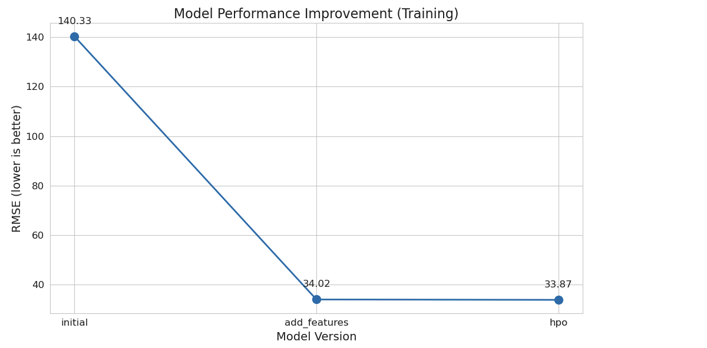
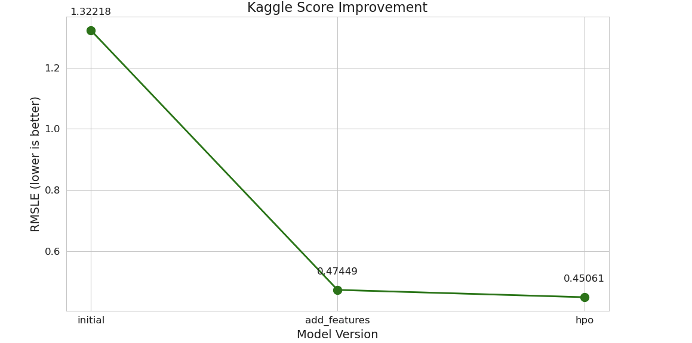

# Report: Predict Bike Sharing Demand with AutoGluon Solution
#### Zakaria Coulibaly

## Initial Training
### What did you realize when you tried to submit your predictions? What changes were needed to the output of the predictor to submit your results?
When submitting predictions, I realized Kaggle requires non-negative values for bike rental counts. The initial model occasionally produced negative predictions, which are invalid for this problem since rental counts cannot be negative. I had to apply post-processing to replace any negative values with 0 before submission.

### What was the top ranked model that performed?
In the initial training, the top-ranked model was WeightedEnsemble_L3 with an RMSE of 140.33. This ensemble combined predictions from multiple base models including LightGBM, CatBoost, and RandomForest models to achieve the best performance on the validation data.

## Exploratory data analysis and feature creation
### What did the exploratory analysis find and how did you add additional features?
Exploratory analysis revealed strong temporal patterns in bike rentals that weren't captured by the basic features. I added five critical datetime-based features:

- hour: Extracted from datetime to capture hourly rental patterns (rush hours vs. off-peak)
- day: Day of month to capture patterns within monthly cycles
- month: To capture seasonal variations
- dayofweek: To distinguish weekday vs. weekend patterns
- year: To account for year-over-year trends

I also properly converted categorical features (season, weather, hour, month, dayofweek) to category data type, ensuring AutoGluon would handle them appropriately.

### How much better did your model preform after adding additional features and why do you think that is?

After adding the datetime features, model performance dramatically improved from a Kaggle score of 1.32218 to 0.47449 - a 64% improvement. 
This substantial gain occurred because bike sharing demand follows strong temporal patterns:

1. Commute hours show peak demand on weekdays
2. Different usage patterns exist between weekdays and weekends
3. Seasonal weather impacts user behavior

By explicitly providing these time patterns as features, the models could capture the cyclical nature of bike demand that was previously hidden within the datetime column.

## Hyper parameter tuning
### How much better did your model preform after trying different hyper parameters?

After hyperparameter optimization, the model's Kaggle score improved from 0.47449 to 0.45061, a further 5% improvement. 
While less dramatic than the feature engineering gains, this refinement helped squeeze additional predictive power from our model.

### If you were given more time with this dataset, where do you think you would spend more time?
With more time, I would focus on:

1. Creating interaction features between weather and time variables (e.g., rain during rush hour vs. rain at night)
2. Developing cyclical encoding for time features to better represent their circular nature
3. Adding external data like holidays, events, and more detailed weather information
4. More extensive hyperparameter tuning with greater computational resources
5. Exploring feature importance to better understand which variables drive predictions

### Create a table with the models you ran, the hyperparameters modified, and the kaggle score.
|model|hpo1|hpo2|hpo3|score|
|--|--|--|--|--|
|initial|default|default|default|1.32218|
|add_features|default|default|default|0.47449|
|hpo|learning_rate: 0.01|num_leaves: 128|depth: 8|0.45061|

### Create a line plot showing the top model score for the three (or more) training runs during the project.

### Create a line plot showing the top kaggle score for the three (or more) prediction submissions during the project.

## Summary

This project demonstrated the process of iteratively improving a machine learning model for bike sharing demand prediction. The most significant improvement came from feature engineering, particularly adding time-based features, which reduced the error by 64%. Hyperparameter optimization provided additional refinement, achieving a final 5% improvement.

The results highlight that understanding the domain and creating relevant features is typically more impactful than algorithmic tuning. The temporal patterns in bike sharing demand (hour of day, day of week, season) proved to be the most important factors in making accurate predictions. AutoGluon's ensemble approach effectively leveraged these features across multiple algorithms, with gradient boosting models showing particularly strong performance.

This systematic approach starting with a baseline, applying domain knowledge for feature engineering, then fine-tuning model parameters, demonstrates an effective workflow for developing high-performing predictive models.
